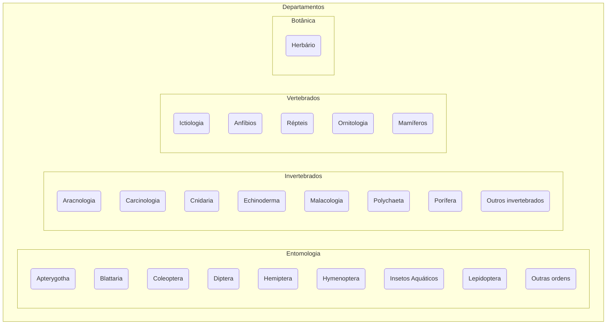

```mermaid
flowchart TB
  subgraph Departamentos
      direction RL    
      subgraph Entomologia
        c1(Apterygotha)
        c2(Blattaria)
        c3(Coleoptera)
        c4(Diptera)
        c6(Hemiptera)
        c7(Hymenoptera)
        c8(Insetos Aquáticos)
        c9(Lepidoptera)
        c10(Outras ordens)
      end
      subgraph Invertebrados
        c11(Aracnologia)
        c12(Carcinologia)
        c13(Cnidaria)
        c14(Echinoderma)
        c15(Malacologia)
        c16(Polychaeta)
        c17(Porífera)
        c18(Outros invertebrados)
      end
      subgraph Vertebrados
        c19(Ictiologia)
        c20(Anfíbios)
        c21(Répteis)
        c22(Ornitologia)
        c24(Mamíferos)
      end
      subgraph Botânica
        c25(Herbário)
      end
  end

```
