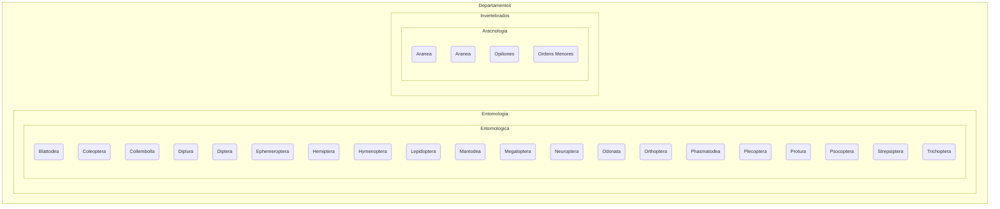

# Modelo de Organização do Museu Nacional-UFRJ

```mermaid
flowchart TB
  subgraph Departamentos
      direction LR    
      subgraph Entomologia
        subgraph Entomologica
          c2(Blattodea)
          c3(Coleoptera)
          c4(Collembolla)
          c5(Diplura)
          c6(Diptera)
          c7(Ephemeroptera)
          c8(Hemiptera)
          c9(Hymenoptera)
          c10(Lepidoptera)
          c11(Mantodea)
          c12(Megaloptera)
          c13(Neuroptera)
          c14(Odonata)
          c15(Orthoptera)
          c16(Phasmatodea)
          c17(Plecoptera)
          c18(Protura)
          c19(Psocoptera)
          c20(Strepsiptera)
          c21(Trichoptera)
        end
      end
      subgraph Invertebrados
        subgraph Aracnologia
          c23(Aranea)
          c24(Aranea)
          c25(Opiliones)
          c26(Ordens Menores)
        end
      end
  end
```
