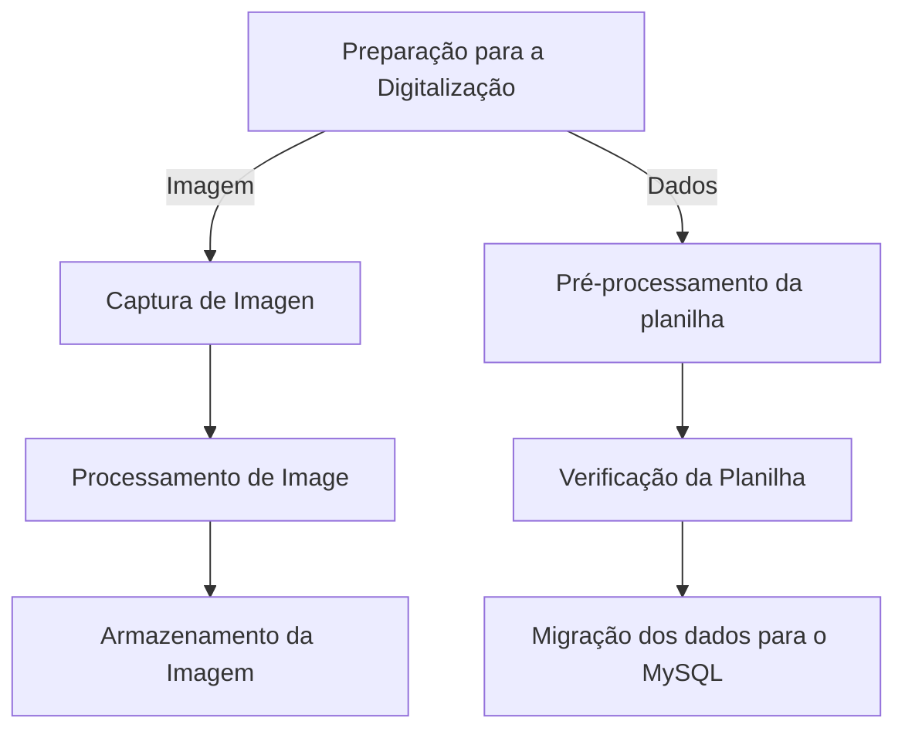

## Fluxograma de Digitalização

```mermaid
graph TB
    A[Preparação para a Digitalização] --Imagem--> B
    B[Captura de Imagen] --> C
    C[Processamento de Image] --> D
    D[Armazenamento da Imagem]
    A --Dados--> 1[Pré-processamento da planilha]
    1 --> 2[Verificação da Planilha]
    2 --> 3[Migração dos dados para o MySQL]
```
